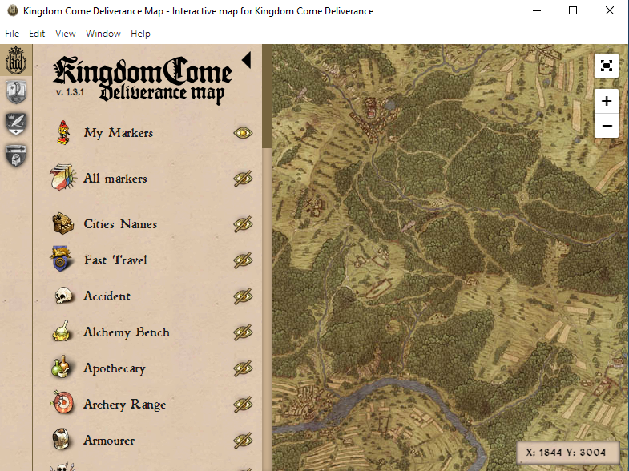

# Interactive Map app for Kingdom Come: Deliverance

[](https://kingdomcomemap.github.io)[](https://discord.gg/gfFAt5JW)

Thanks to RogerHN's [kingdomcomemap.github.io](https://kingdomcomemap.github.io) you can use the Kindom Come map even when not in game, City names, Fast travel points etc. You can see many points such as on this map and add our own markers. But it has a small problem: you always need to have an internet connection or browser to use this map. Here's a desktop app that Kingdom Come players can use offline. Created using electron and [kingdomcomemap source codes](https://github.com/kingdomcomemap/kingdomcomemap.github.io).

<br>


Screenshot of how the application looks on Windows operating system


<br>

## Installation
Currently available for download on Windows and Linux,
go to [Download Latest Version](https://github.com/ahmetcanisik/kingdomcomemap-desktop/releases/latest)


<br>

## Source Codes
[Source codes](https://github.com/ahmetcanisik/kingdomcomemap-desktop/tree/master/source) are presented openly for those who want to develop the project on their own. After downloading the source codes, follow these steps for installation.
```bash
# install with npm
npm install

# or pnpm
pnpm install

# or yarn
yarn install
```


After the installation is complete, launch the electron application with these codes:
```bash
yarn start
```


If you want to convert the project into a desktop application, these codes will work.
```bash
# Whatever your operating system is, Electron will build the application accordingly.
yarn build

# If you want the application to run on Windows, add this to the output command: --win
yarn build --win

# If you want the application to run on Linux, add this to the output command: --linux
yarn build --linux
```

<br>

## Creators
<a href="https://github.com/rogerhnn" target="_blank"></a>
<a href="https://github.com/ahmetcanisik" target="_blank"></a>
